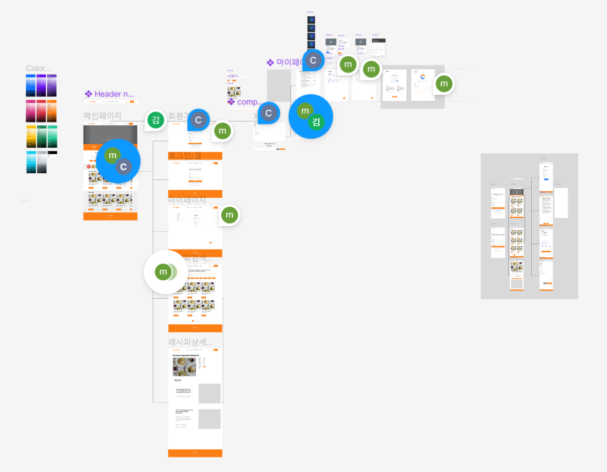
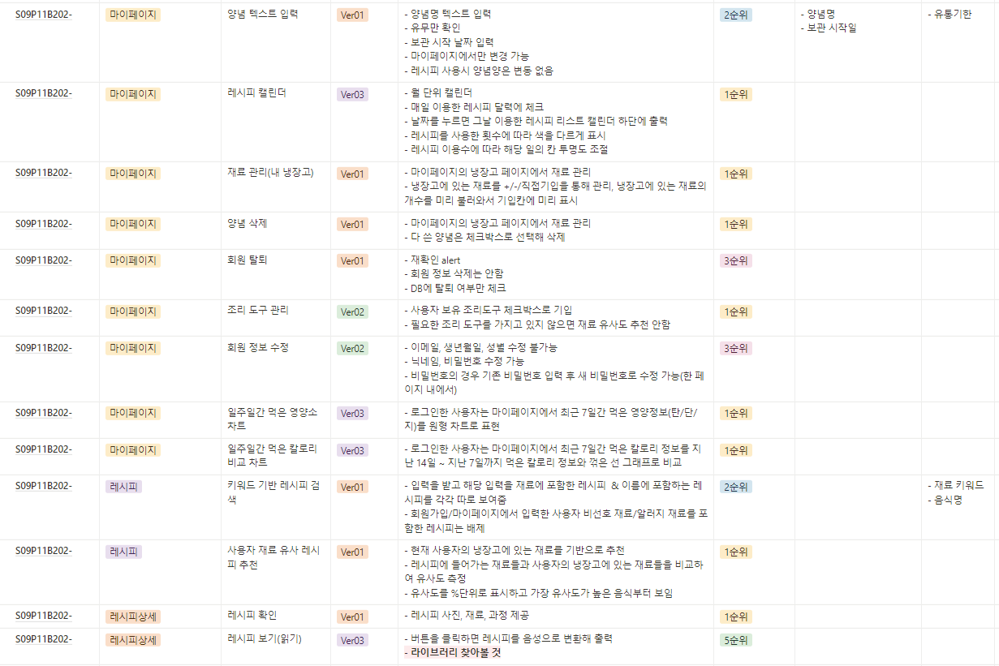
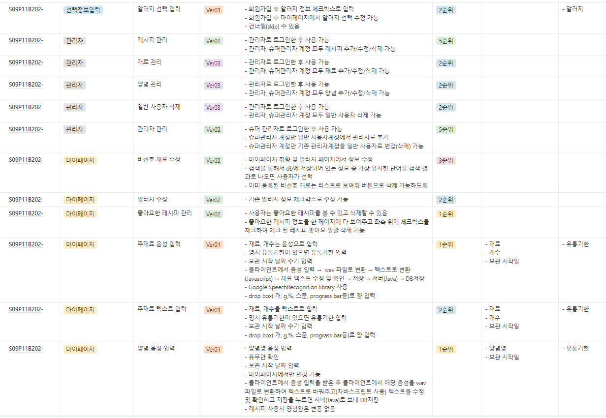
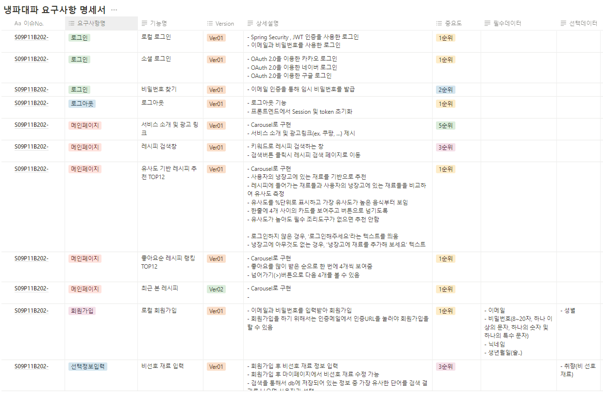
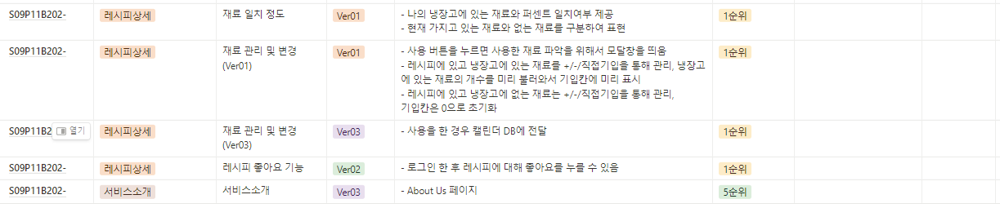

## 2023년 07월 11일

~~### 모의 투자~~

~~- 주식 관련 공부를 하고 싶은데 실제 돈으로 경험하기에는 부담스러운 사람을 위해서 제공하는 서비스~~
~~- 과거의 주식 데이터를 불러와 가상 자산을 투자를 하며 투자를 공부하는 서비스~~

~~- 기능~~
    ~~- 투자 페이지로 들어가 과거 한 주식의 데이터를 받아온 뒤, 자본을 구해 순위를 내는 시스템~~
    ~~- 회원 가입 한 뒤, 기본 자본금을 주어준 뒤, 그 자본금으로 투자~~
    ~~- 종목 별로 투자 방을 만들어 투자하도록 하여 투자 금액과 수익 금액을 판단~~

## 2023년 07월 12일

### 냉장고 속 재료 레시피 서비스
- 냉장고 속 재료를 입력하여 해당 재료를 바탕으로 한 레시피를 추천해 주는 서비스
- 재료 입력 방식은 직접 입력, 음성 입력, 영수증 사진 분석 입력(고민 중)
- 레시피의 사용 버튼을 통해 냉장고 속 남은 재료 관리
    - 사용한 재료의 양을 유저가 편리하게 입력할 수 있는 기능이 추가적으로 필요
- 재료의 유통기한(존재하면)과 보관기간을 보여주는 기능
- 레시피를 검색 할 때, 현재 입력된 냉장고 속 재료와 얼마나 일치하는지 보여주는 기능

## 2023년 07월 14일

### 서비스 구상 및 와이드프레임
1. 발표 중 나온 질문
    - 음성 인식이 정확하지 않을 수 있다 ex. 계란이라고 말하면 겨란, 계란이 라고 입력됨
    - 취향 입력?? -> 근데 이거 회원가입할 떄 받기로 하지 않앗나?
    - 타겟팅? ?
    - 어플이라면 한번쯤 사용할 것 같긴 하다. 근데 노트북으로 하면 안 쓸 것 같다 -> 이건 웹앱으로 하기로 했숨
    - 크롤링한 데이터를 모아서 넣지 않으면 어려울 것이다
    - 레시피가 되게 다양한데 사진이 없는 레시피는 어쩔 것?
    - 에어프라이어, 오븐 등 부분적으로 갖고 있는 사람에 대한 기능이 있는지? -> 레시피 필터링

2. 목업 페이지 구성
    - 프론트엔드 페이지 구성
    - 메인 페이지 냉장고 컴포넌트, 레시피 컴포넌트 위치 및 구상
    - 클릭을 통해 넘어갈 상세 페이지 구상
    - 냉장고 재료 추가 페이지(모달) 구상
    - 냉장고 재료 제거 모달 구상
    - 레시피 디테일 페이지 구상

## 2023년 07월 17일(월)

1. FrontEnd 기준 와이어 프레임, 목업 제작
2. 컨설팅 후 기획, 명세서 관련 추가 회의

## 2023년 07월 18일(화)

1. 명세서 수정 및 ERD 수정 회의

