### 목차

| [소개](#소개)                               | [구현](#구현)                                           | [마치며](#마치며)                           |
| :------------------------------------------ | :------------------------------------------------------ | :------------------------------------------ |
| [:book: 개요](#book-개요)                   | [:dart: 주요 페이지 및 기능](#dart-주요-페이지-및-기능) | [:boy: 팀원](#boy-팀원)                     |
| [:bulb: 프로젝트 기획](#bulb-프로젝트-기획) | [:rocket: 기능시연](#rocket-기능시연)                   | [:mega: 소감](#mega-소감)                   |
| [:cactus: 빌드 환경](#cactus-빌드-환경)     | [:eyes: 산출물](#eyes-산출물)                           | [:seedling: 회고 기록](#seedling-회고-기록) |
|                                             | [:books: 파일 구조도](#books-파일-구조도)               |                                             |

<br/>

# 소개

## :book: 개요

**_👏 SSAFY 9기 2학기 공통 프로젝트 👏_**  
냉장고 속 재료를 기반으로 레시피를 추천하는 서비스 <strong>냉파대파_NangPaDaePa</strong> :fork_and_knife:
> 2023.07.04 ~ 2023.8.18 (7주)

<br/>

[🔼 목차로 돌아가기](#목차)

<br/>

## :bulb: 프로젝트 기획

### UCC

[](.)

<br/>

### 배경

**"환경오염의 주된 원인은 음식물 쓰레기라 밝혀져..."**

> ...

**"요리초보는 레시피를 잘 몰라.."**

> ...

<br/>

[🔼 목차로 돌아가기](#목차)

<br/>

## :cactus: 빌드 환경

| FrontEnd                          | BackEnd                                      | Database      | Infra                      |
| :-------------------------------- | :------------------------------------------- | :------------ | :------------------------- |
| Vue 3.3.7                         | Java 17 (Azul Zulu version 17.0.9)           | MongoDB 7.0.2 | AWS EC2 (Ubuntu 20.04 LTS) |
| Vite 5.0.0-beta.12                | Spring Boot 3.1.5                            | Redis 7.2.2   | Nginx 1.18.0               |
| VueUse(core) 10.5.0               | Gradle 8.3                                   |               | GitLab CICD                |
| UnoCSS 0.57.1                     | JPA                                          |               | Jenkins 2.429              |
| vite-plugin-vue-devtolls 1.0.0-rc | IntelliJ IDEA 2023.2.5<br>(Ultimate Edition) |               | Docker 24.0.6              |
| typescript 0.57.1                 | Lombok                                       |               |                            |
| Pnpm 8.9.2                        | Mail                                         |
| Pinia 2.1.7                       | JWT                                          |
| Pinia-plugin-persist 1.0.0        | Spring Data MongoDB                          |
| Pinia-plugin-persistedstate 3.2.0 | Swagger                                      |
| vue-json-pretty 2.2.4             |
| vue-router 4.2.5                  |
| vue3-ts-jsoneditor 2.9.0          |

<br>

[🔼 목차로 돌아가기](#목차)

<br>

# 구현

## :dart: 주요 페이지 및 기능

### Intro


> 인트로 페이지 입니다. '시작하기' 버튼을 누르면 로그인 페이지로 이동합니다.  
> 로그인이 되어있다면 메인 페이지로 이동합니다.

<br>
<br>

### Login & Regist

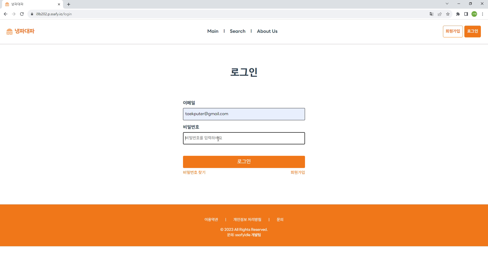

> 로그인 페이지입니다. 구글과 깃허브 소셜 로그인이 가능합니다.  
> 첫 로그인시 회원가입됩니다.

<br>
<br>

### Main


> 메인페이지입니다. 좌측에 워크스페이스 리스트와 로그인한 소셜 계정의 정보가 나타납니다.  
> 최근 방문한 워크스페이스 정보와 알람 리스트가있습니다.

<br>
<br>
   
### Workspace

|                                        Overview                                        |                      Document 생성                       |
| :------------------------------------------------------------------------------------: | :------------------------------------------------------: |
|                                    |  |
| 워크스페이스 첫 화면입니다.<br>간단한 설명 및 내부 컬렉션을 즐겨찾기 해둘 수 있습니다. | 좌측 상단의 '+' 버튼으로 Document를 생성할 수 있습니다.  |

|                   Workspace 수정                    |                                   Workspace 세팅                                    |
| :-------------------------------------------------: | :---------------------------------------------------------------------------------: |
|  |                                     |
|   워크스페이스에 대한 설명란을 수정한 모습입니다.   | setting탭에 들어간 모습입니다.<br>워크스페이스 이름과 색상 등을 변경할 수 있습니다. |

|                      Workspace 초대                       |                   초대 수락                   |                                   초대 확인                                   |
| :-------------------------------------------------------: | :-------------------------------------------: | :---------------------------------------------------------------------------: |
|           |   |                                   |
| 이메일로 다른 사용자를 워크스페이스에 초대할 수 있습니다. | 이메일 온 모습이며, 링크를 누르면 수락됩니다. | 초대를 수락하면 Overview 우측 하단에 Contributors에 사용자 목록이 나타납니다. |

|                               사용자 권한 설정                                |                         Workspace 나가기                          |
| :---------------------------------------------------------------------------: | :---------------------------------------------------------------: |
|                           |               |
| 워크스페이스 멤버의 권한을 admin, member, viewer로 나누어 설정할 수 있습니다. | setting 란 최하단에서 워크스페이스를 떠나거나 삭제할 수 있습니다. |

<br>
<br>

### Collection

|                                    Document 옵션                                     |                                                              Collection 옵션                                                               |
| :----------------------------------------------------------------------------------: | :----------------------------------------------------------------------------------------------------------------------------------------: |
|                                         |                                                                                                 |
| document의 옵션에서 하위 컬렉션추가, 도큐먼트 삭제, 도큐먼트 이름 변경이 가능합니다. | collection의 옵션에서 하위 컬렉션 추가, 컬렉션 삭제, 리퀘스트 추가, 컬렉션 이름 변경이 가능합니다.<br>리퀘스트 옵션에선 삭제가 가능합니다. |

<br><br>

### Request

|                                                          Request 전송                                                           |                                     Request Params                                     |
| :-----------------------------------------------------------------------------------------------------------------------------: | :------------------------------------------------------------------------------------: |
|                                                                                         |                                        |
| 메서드를 선택하고 URL을 입력 후 'Send' 버튼을 누르면 API 요청을 보낼 수 있습니다.<br>응답 결과는 하단 Response 란에 나타납니다. | Params 탭에서 파라미터를 수정할 수 있습니다.<br>API요청 시 쿼리 파라미터로 전송됩니다. |

|             Request 메서드              |                                       Request 저장                                       |
| :-------------------------------------: | :--------------------------------------------------------------------------------------: |
|  |                                              |
|    http 메서드를 수정할 수 있습니다.    | 리퀘스트에 입력 된 정보를 바꾸면 우측 상단 'Save' 버튼이 활성화 되고, 누르면 저장됩니다. |

|                                                                                Request Headers                                                                                |                                                                Request Body                                                                 |
| :---------------------------------------------------------------------------------------------------------------------------------------------------------------------------: | :-----------------------------------------------------------------------------------------------------------------------------------------: |
|                                                                                                                                       |                                                                                                     |
| 리퀘스트의 헤더를 설정할 수 있습니다.<br>active 체크박스를 통해 행의 활성/비활성을 설정 할 수 있습니다.<br>key-value로 헤더를 설정하고 Description에 설명을 적을 수 있습니다. | 바디에는 json형식으로 데이터를 담을 수 있습니다.<br>vue3-ts-jsoneditor의 에디터로 데이터를 텍스트 및 트리구조로 확인 및 수정할 수 있습니다. |

|                            Request 400 error                             |                            Request 500 error                             |
| :----------------------------------------------------------------------: | :----------------------------------------------------------------------: |
|                                 |                                |
| 응답 결과가 404인 모습입니다.<br>상태코드가 붉은색 바와 함께 보여집니다. | 응답 결과가 503인 모습입니다.<br>상태코드가 노란색 바와 함께 보여집니다. |

<br>
<br>

### History


> 보낸 리퀘스트 요청들을 확인할 수 있습니다. 어느 워크스페이스의 무슨 메서드 요청인지 확인할 수 있고, 응답 상태코드와 걸린 시간이 표시됩니다.  
> 히스토리 목록에서 요청기록을 클릭하면, Request와 똑같이 요청정보가 나타나고, 저장이나 요청으로 응답을 확인할 수 있습니다.

<br>
<br>

### Extenstion

|                                                           팝업                                                            |                     로그인 성공                     |
| :-----------------------------------------------------------------------------------------------------------------------: | :-------------------------------------------------: |
|                                                                                                    |                  |
| 크롬 확장프로그램으로 SAPIER 서비스를 이용할 수 있도록 구현했습니다.<br>로그인 페이지와 같이 소셜로 로그인할 수 있습니다. | 로그인이 성공하면, 로그인 성공 페이지로 이동합니다. |

|                                                                    플로팅 1                                                                    |                         플로팅 2                          |
| :--------------------------------------------------------------------------------------------------------------------------------------------: | :-------------------------------------------------------: |
|                                                                                                                     |                              |
| 확장프로그램에서 소셜로그인하면 우측 하단에 버튼이 나타납니다.<br>버튼을 클릭하면 플로팅 페이지가 나타나서 SAPIER 서비스를 이용할 수 있습니다. | 확장프로그램에서 Request를 보내고 응답을 받은 모습입니다. |

<br/>

[🔼 목차로 돌아가기](#목차)

<br/>

## :rocket: 기능시연

|              로그인               |
| :-------------------------------: |
|    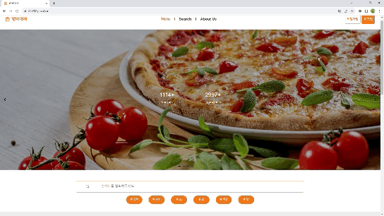    |
| - 소셜 로그인 시 메인 페이지 이동 |

|                                                                    워크스페이스                                                                     |
| :-------------------------------------------------------------------------------------------------------------------------------------------------: |
|                                                                                                          |
| - 워크스페이스 Overview에서 설명 편집 가능<br>- Setting에서 이름, 색상 설정 가능<br>- 이메일로 멤버 초대 가능<br>- 워크스페이스 떠나기 및 삭제 가능 |

|                                                컬렉션                                                |
| :--------------------------------------------------------------------------------------------------: |
|                                                                   |
| - 컬렉션 생성 및 이름 수정, 삭제 가능<br>- 하위 컬렉션 및 리퀘스트 생성 가능<br>- 리퀘스트 삭제 가능 |

|                                                                                                                                                                                                                              리퀘스트                                                                                                                                                                                                                              |
| :----------------------------------------------------------------------------------------------------------------------------------------------------------------------------------------------------------------------------------------------------------------------------------------------------------------------------------------------------------------------------------------------------------------------------------------------------------------: |
|                                                                                                                                                                                                                                                                                                                                                                                                                                         |
| - 컬렉션 리스트에서 리퀘스트를 누르면 우측에 정보 표시<br>- 리퀘스트 제목, 메서드, URL, 파라미터, 헤더, 바디 수정 가능. 수정하면 'Save'버튼이 활성화 되고 누르면 저장 됨<br>- 파라미터와 헤더는 표 형식으로 active를 통해 행 활성/비활성 가능<br>- 입력 된 정보로 요청을 보내 응답 확인가능<br>- 응답은 200대는 초록, 400대는 빨강, 500대는 노랑으로 상태코드와 함께 색상이 표시 됨<br>- 응답 정보는 헤더와 바디로 표시되고, 각각 key-value와 json형식으로 표시 됨 |

|                                                                                                                                  히스토리                                                                                                                                  |
| :------------------------------------------------------------------------------------------------------------------------------------------------------------------------------------------------------------------------------------------------------------------------: |
|                                                                                                                                                                                                                                             |
| - 보낸 요청 기록을 확인할 수 있음<br>- 날짜별로 구분되고, 요청이 소속된 워크스페이스가 표시 됨<br>- 요청마다 메서드와 제목이 표시되고, 응답 결과의 상태코드와 소요시간이 나타남<br>- 요청기록을 클릭하면, Request와 마찬가지로 정보가 입력되고, 같은 기능을 사용할 수 있음 |

|             팝업 로그인             |            플로팅 컬렉션            |           플로팅 리퀘스트            |
| :---------------------------------: | :---------------------------------: | :----------------------------------: |
|  |  |       |
|   팝업 소셜로그인 및 성공 페이지    |  플로팅에서 컬렉션 생성/수정/삭제   | 플로팅에서 리퀘스트 요청 및 응답화면 |

<br/>

[🔼 목차로 돌아가기](#목차)

<br/>

## :eyes: 산출물

### 요구사항명세서
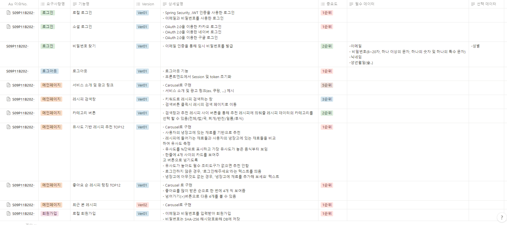
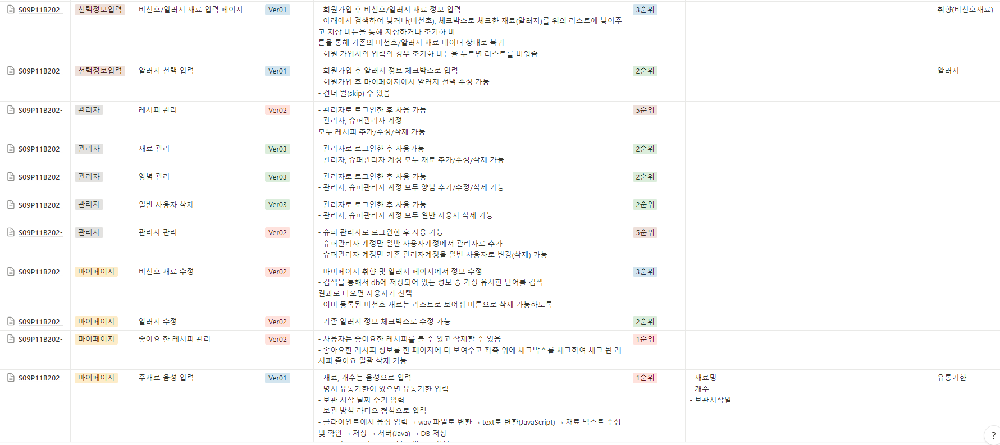

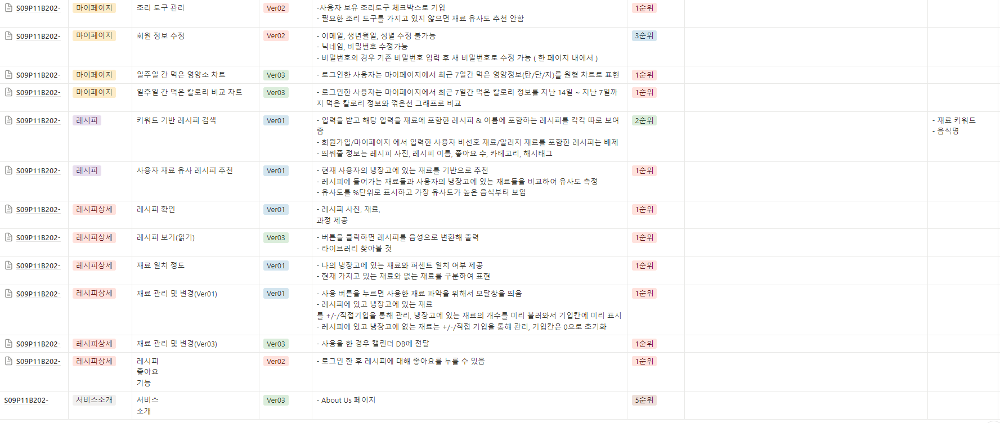

### API 명세서
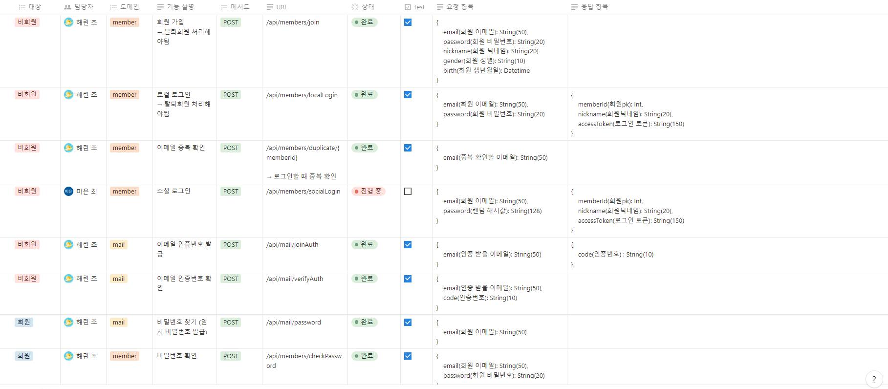
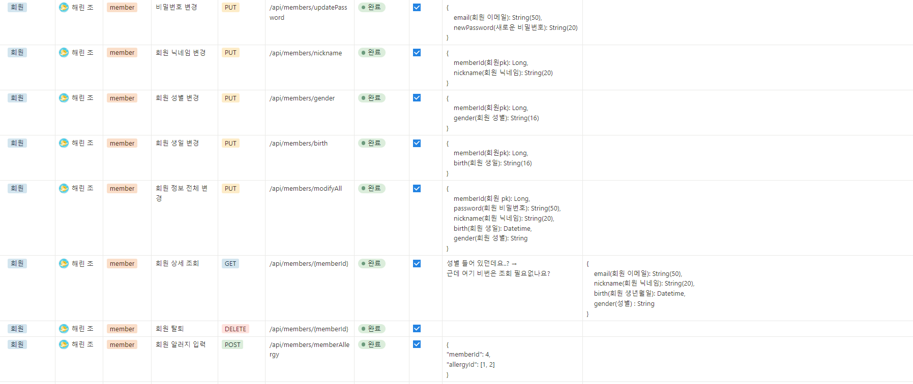
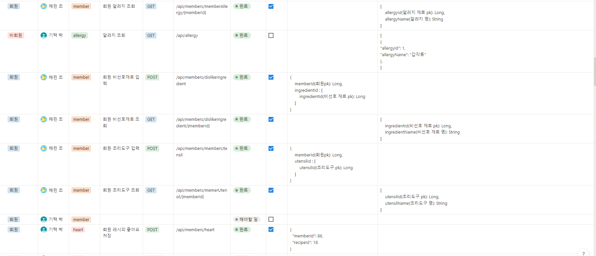
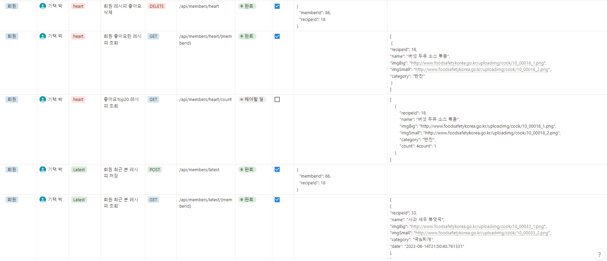
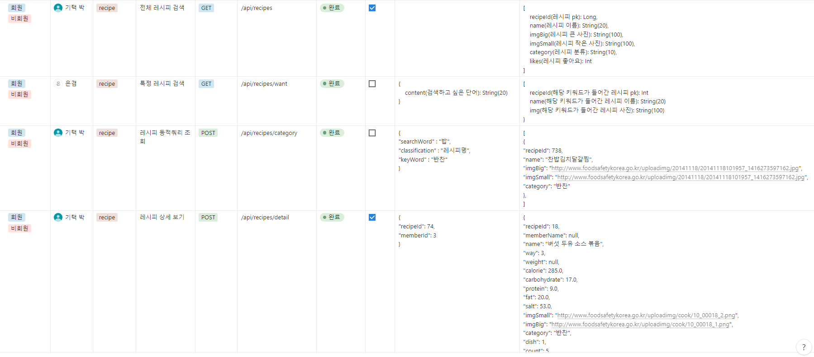
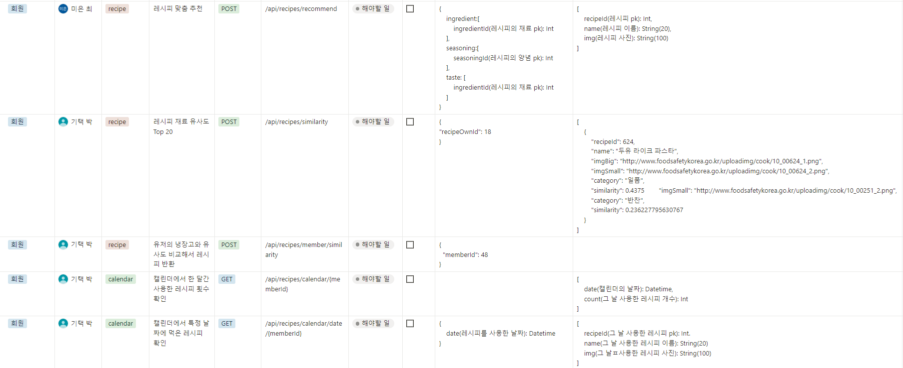
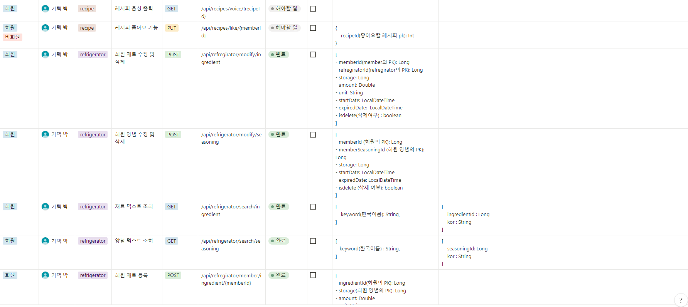
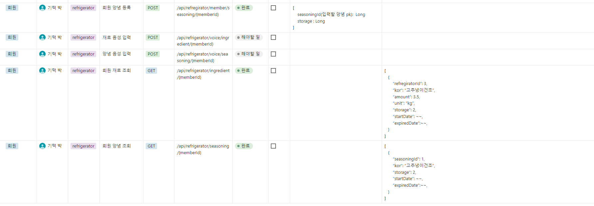

### 와이어 프레임
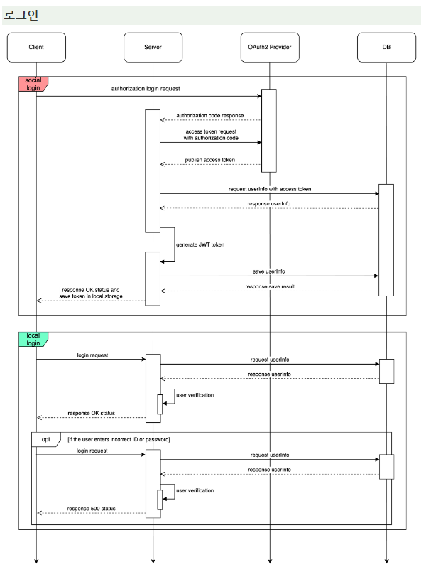
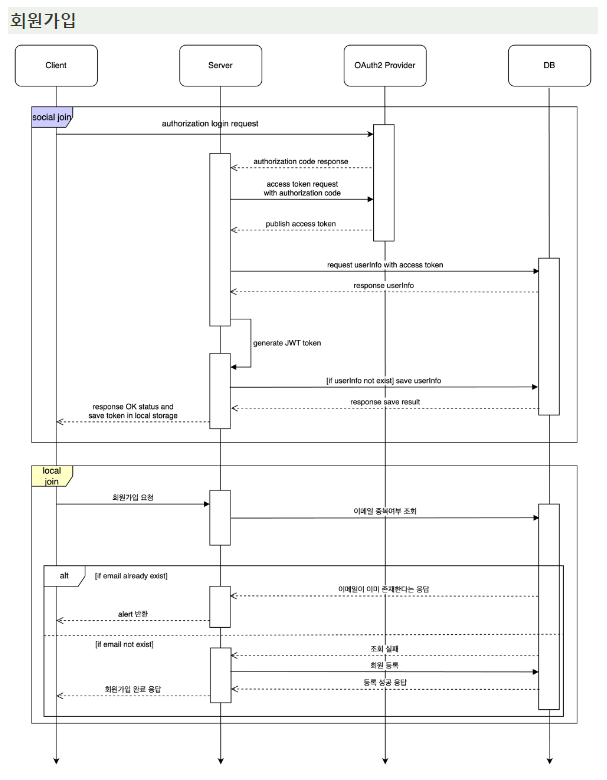
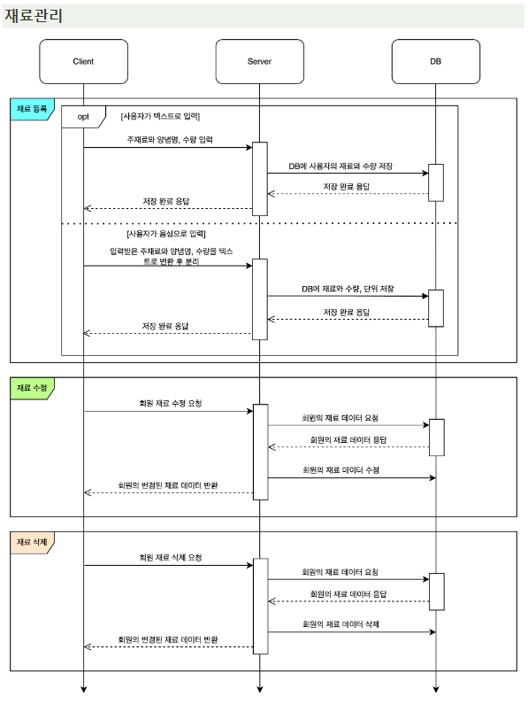
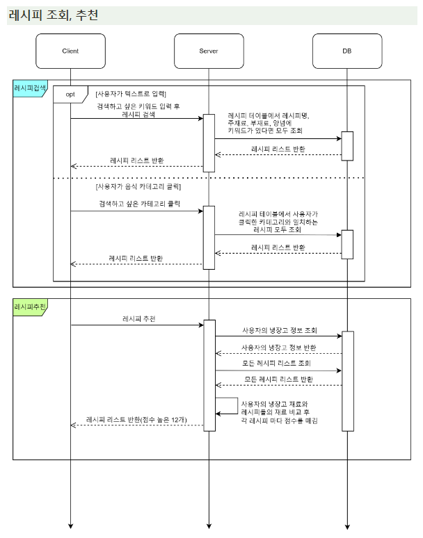
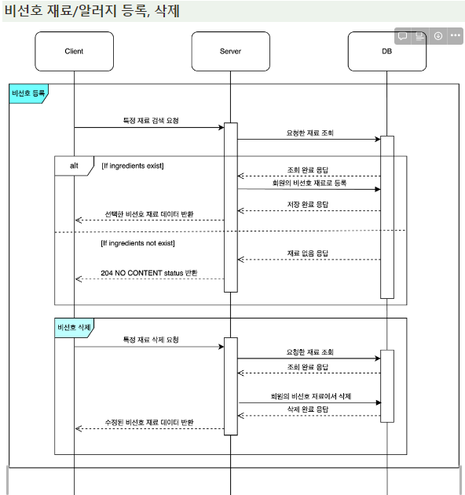
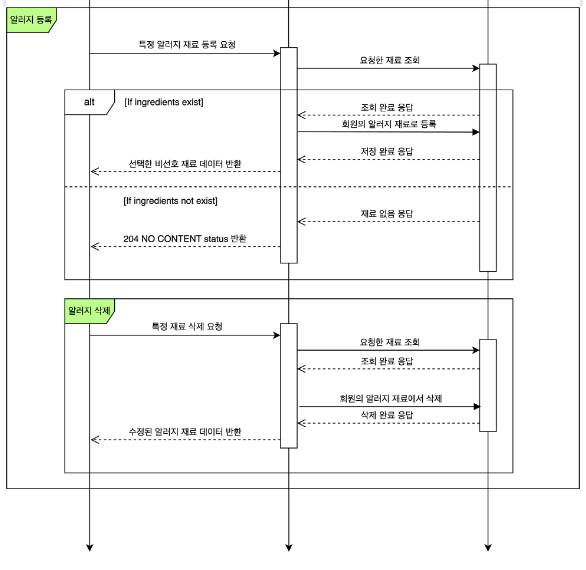
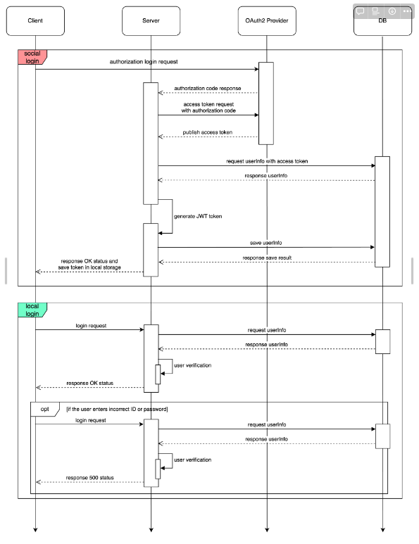

### 목업 디자인
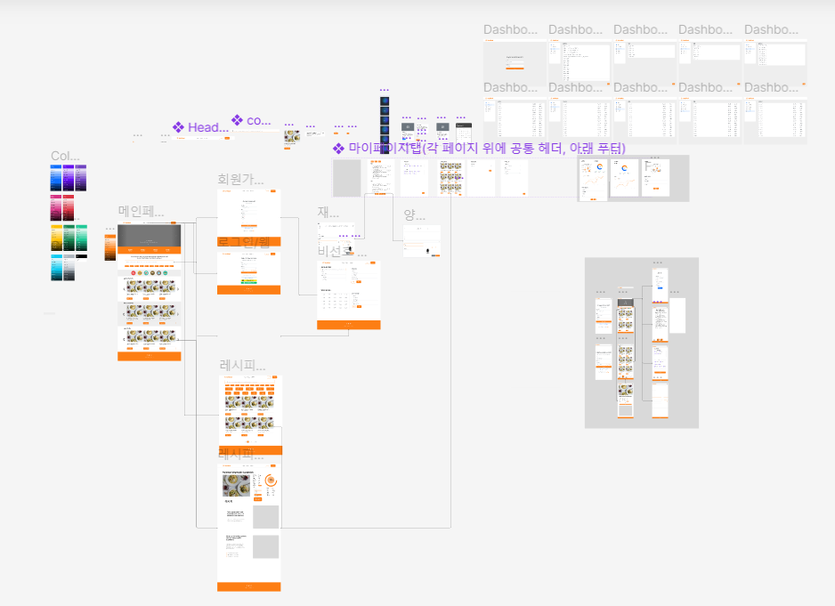

### 데이터플로우
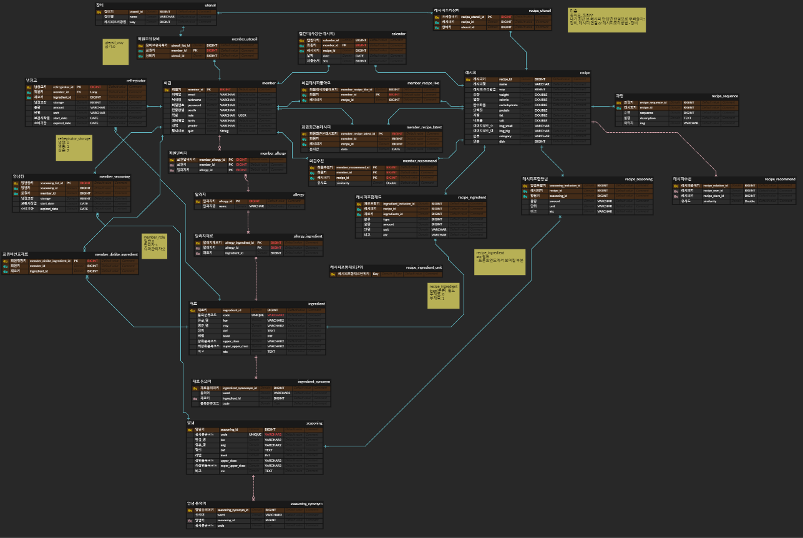

### 시스템 구조도


### 최종발표 ppt


<br>


<br/>

## :books: 파일 구조도

### FrontEnd

```
📦frontend
 ┗ 📂sapier
 ┃ ┣ 📂conf
 ┃ ┣ 📂cypress
 ┃ ┃ ┣ 📂e2e
 ┃ ┣ 📂locales
 ┃ ┃ ┣ 📂disable
 ┃ ┣ 📂public
 ┃ ┣ 📂src
 ┃ ┃ ┣ 📂components
 ┃ ┃ ┃ ┣ 📂history
 ┃ ┃ ┃ ┣ 📂intro
 ┃ ┃ ┃ ┣ 📂login
 ┃ ┃ ┃ ┣ 📂main
 ┃ ┃ ┃ ┣ 📂Request
 ┃ ┃ ┃ ┣ 📂workspace
 ┃ ┃ ┣ 📂composables
 ┃ ┃ ┣ 📂layouts
 ┃ ┃ ┣ 📂modules
 ┃ ┃ ┣ 📂pages
 ┃ ┃ ┃ ┣ 📂histories
 ┃ ┃ ┃ ┣ 📂login
 ┃ ┃ ┃ ┣ 📂work
 ┃ ┃ ┣ 📂plugins
 ┃ ┃ ┣ 📂stores
 ┃ ┃ ┣ 📂styles
 ┃ ┣ 📂test
 ┃ ┃ ┣ 📂__snapshots__
```

### BackEnd

```
📦backend
 ┗ 📂sapaier
 ┃ ┣ 📂build
 ┃ ┃ ┣ 📂classes
 ┃ ┃ ┃ ┗ 📂java
 ┃ ┃ ┃ ┃ ┗ 📂main
 ┃ ┃ ┃ ┃ ┃ ┗ 📂com
 ┃ ┃ ┃ ┃ ┃ ┃ ┗ 📂esfp
 ┃ ┃ ┃ ┃ ┃ ┃ ┃ ┗ 📂sapaier
 ┃ ┃ ┃ ┃ ┃ ┃ ┃ ┃ ┣ 📂domain
 ┃ ┃ ┃ ┃ ┃ ┃ ┃ ┃ ┃ ┣ 📂collection
 ┃ ┃ ┃ ┃ ┃ ┃ ┃ ┃ ┃ ┃ ┣ 📂controller
 ┃ ┃ ┃ ┃ ┃ ┃ ┃ ┃ ┃ ┃ ┣ 📂exception
 ┃ ┃ ┃ ┃ ┃ ┃ ┃ ┃ ┃ ┃ ┣ 📂model
 ┃ ┃ ┃ ┃ ┃ ┃ ┃ ┃ ┃ ┃ ┃ ┣ 📂dto
 ┃ ┃ ┃ ┃ ┃ ┃ ┃ ┃ ┃ ┃ ┃ ┃ ┣ 📂request
 ┃ ┃ ┃ ┃ ┃ ┃ ┃ ┃ ┃ ┃ ┃ ┃ ┗ 📂response
 ┃ ┃ ┃ ┃ ┃ ┃ ┃ ┃ ┃ ┃ ┃ ┗ 📂vo
 ┃ ┃ ┃ ┃ ┃ ┃ ┃ ┃ ┃ ┃ ┣ 📂repository
 ┃ ┃ ┃ ┃ ┃ ┃ ┃ ┃ ┃ ┃ ┃ ┗ 📂entity
 ┃ ┃ ┃ ┃ ┃ ┃ ┃ ┃ ┃ ┃ ┗ 📂service
 ┃ ┃ ┃ ┃ ┃ ┃ ┃ ┃ ┃ ┣ 📂history
 ┃ ┃ ┃ ┃ ┃ ┃ ┃ ┃ ┃ ┃ ┣ 📂controller
 ┃ ┃ ┃ ┃ ┃ ┃ ┃ ┃ ┃ ┃ ┣ 📂model
 ┃ ┃ ┃ ┃ ┃ ┃ ┃ ┃ ┃ ┃ ┃ ┗ 📂dto
 ┃ ┃ ┃ ┃ ┃ ┃ ┃ ┃ ┃ ┃ ┃ ┃ ┗ 📂request
 ┃ ┃ ┃ ┃ ┃ ┃ ┃ ┃ ┃ ┃ ┣ 📂repository
 ┃ ┃ ┃ ┃ ┃ ┃ ┃ ┃ ┃ ┃ ┃ ┗ 📂entity
 ┃ ┃ ┃ ┃ ┃ ┃ ┃ ┃ ┃ ┃ ┗ 📂service
 ┃ ┃ ┃ ┃ ┃ ┃ ┃ ┃ ┃ ┣ 📂user
 ┃ ┃ ┃ ┃ ┃ ┃ ┃ ┃ ┃ ┃ ┣ 📂controller
 ┃ ┃ ┃ ┃ ┃ ┃ ┃ ┃ ┃ ┃ ┣ 📂model
 ┃ ┃ ┃ ┃ ┃ ┃ ┃ ┃ ┃ ┃ ┃ ┣ 📂dto
 ┃ ┃ ┃ ┃ ┃ ┃ ┃ ┃ ┃ ┃ ┃ ┗ 📂vo
 ┃ ┃ ┃ ┃ ┃ ┃ ┃ ┃ ┃ ┃ ┣ 📂repository
 ┃ ┃ ┃ ┃ ┃ ┃ ┃ ┃ ┃ ┃ ┃ ┣ 📂entity
 ┃ ┃ ┃ ┃ ┃ ┃ ┃ ┃ ┃ ┃ ┗ 📂service
 ┃ ┃ ┃ ┃ ┃ ┃ ┃ ┃ ┃ ┗ 📂workspace
 ┃ ┃ ┃ ┃ ┃ ┃ ┃ ┃ ┃ ┃ ┣ 📂controller
 ┃ ┃ ┃ ┃ ┃ ┃ ┃ ┃ ┃ ┃ ┣ 📂document
 ┃ ┃ ┃ ┃ ┃ ┃ ┃ ┃ ┃ ┃ ┣ 📂dto
 ┃ ┃ ┃ ┃ ┃ ┃ ┃ ┃ ┃ ┃ ┣ 📂exception
 ┃ ┃ ┃ ┃ ┃ ┃ ┃ ┃ ┃ ┃ ┣ 📂repository
 ┃ ┃ ┃ ┃ ┃ ┃ ┃ ┃ ┃ ┃ ┗ 📂service
 ┃ ┃ ┃ ┃ ┃ ┃ ┃ ┃ ┣ 📂global
 ┃ ┃ ┃ ┃ ┃ ┃ ┃ ┃ ┃ ┣ 📂auth
 ┃ ┃ ┃ ┃ ┃ ┃ ┃ ┃ ┃ ┃ ┣ 📂exception
 ┃ ┃ ┃ ┃ ┃ ┃ ┃ ┃ ┃ ┃ ┣ 📂filter
 ┃ ┃ ┃ ┃ ┃ ┃ ┃ ┃ ┃ ┃ ┣ 📂handler
 ┃ ┃ ┃ ┃ ┃ ┃ ┃ ┃ ┃ ┃ ┣ 📂model
 ┃ ┃ ┃ ┃ ┃ ┃ ┃ ┃ ┃ ┃ ┃ ┣ 📂dto
 ┃ ┃ ┃ ┃ ┃ ┃ ┃ ┃ ┃ ┃ ┃ ┗ 📂vo
 ┃ ┃ ┃ ┃ ┃ ┃ ┃ ┃ ┃ ┃ ┣ 📂repository
 ┃ ┃ ┃ ┃ ┃ ┃ ┃ ┃ ┃ ┃ ┃ ┣ 📂entity
 ┃ ┃ ┃ ┃ ┃ ┃ ┃ ┃ ┃ ┃ ┣ 📂service
 ┃ ┃ ┃ ┃ ┃ ┃ ┃ ┃ ┃ ┃ ┗ 📂util
 ┃ ┃ ┃ ┃ ┃ ┃ ┃ ┃ ┃ ┗ 📂config
 ┃ ┃ ┣ 📂generated
 ┃ ┃ ┃ ┗ 📂sources
 ┃ ┃ ┃ ┃ ┣ 📂annotationProcessor
 ┃ ┃ ┃ ┃ ┃ ┗ 📂java
 ┃ ┃ ┃ ┃ ┃ ┃ ┗ 📂main
 ┃ ┃ ┃ ┃ ┗ 📂headers
 ┃ ┃ ┃ ┃ ┃ ┗ 📂java
 ┃ ┃ ┃ ┃ ┃ ┃ ┗ 📂main
 ┃ ┃ ┣ 📂resources
 ┃ ┃ ┃ ┗ 📂main
 ┃ ┃ ┗ 📂tmp
 ┃ ┃ ┃ ┗ 📂compileJava
 ┃ ┃ ┃ ┃ ┣ 📂compileTransaction
 ┃ ┃ ┃ ┃ ┃ ┣ 📂backup-dir
 ┃ ┃ ┃ ┃ ┃ ┗ 📂stash-dir
 ┃ ┣ 📂docs
 ┃ ┣ 📂gradle
 ┃ ┃ ┗ 📂wrapper
 ┃ ┣ 📂src
 ┃ ┃ ┣ 📂main
 ┃ ┃ ┃ ┣ 📂java
 ┃ ┃ ┃ ┃ ┗ 📂com
 ┃ ┃ ┃ ┃ ┃ ┗ 📂esfp
 ┃ ┃ ┃ ┃ ┃ ┃ ┗ 📂sapaier
 ┃ ┃ ┃ ┃ ┃ ┃ ┃ ┣ 📂domain
 ┃ ┃ ┃ ┃ ┃ ┃ ┃ ┃ ┣ 📂collection
 ┃ ┃ ┃ ┃ ┃ ┃ ┃ ┃ ┃ ┣ 📂controller
 ┃ ┃ ┃ ┃ ┃ ┃ ┃ ┃ ┃ ┣ 📂exception
 ┃ ┃ ┃ ┃ ┃ ┃ ┃ ┃ ┃ ┣ 📂model
 ┃ ┃ ┃ ┃ ┃ ┃ ┃ ┃ ┃ ┃ ┣ 📂dto
 ┃ ┃ ┃ ┃ ┃ ┃ ┃ ┃ ┃ ┃ ┃ ┣ 📂request
 ┃ ┃ ┃ ┃ ┃ ┃ ┃ ┃ ┃ ┃ ┃ ┗ 📂response
 ┃ ┃ ┃ ┃ ┃ ┃ ┃ ┃ ┃ ┃ ┗ 📂vo
 ┃ ┃ ┃ ┃ ┃ ┃ ┃ ┃ ┃ ┣ 📂repository
 ┃ ┃ ┃ ┃ ┃ ┃ ┃ ┃ ┃ ┃ ┣ 📂entity
 ┃ ┃ ┃ ┃ ┃ ┃ ┃ ┃ ┃ ┗ 📂service
 ┃ ┃ ┃ ┃ ┃ ┃ ┃ ┃ ┣ 📂history
 ┃ ┃ ┃ ┃ ┃ ┃ ┃ ┃ ┃ ┣ 📂controller
 ┃ ┃ ┃ ┃ ┃ ┃ ┃ ┃ ┃ ┣ 📂model
 ┃ ┃ ┃ ┃ ┃ ┃ ┃ ┃ ┃ ┃ ┗ 📂dto
 ┃ ┃ ┃ ┃ ┃ ┃ ┃ ┃ ┃ ┃ ┃ ┣ 📂request
 ┃ ┃ ┃ ┃ ┃ ┃ ┃ ┃ ┃ ┣ 📂repository
 ┃ ┃ ┃ ┃ ┃ ┃ ┃ ┃ ┃ ┃ ┣ 📂entity
 ┃ ┃ ┃ ┃ ┃ ┃ ┃ ┃ ┃ ┗ 📂service
 ┃ ┃ ┃ ┃ ┃ ┃ ┃ ┃ ┣ 📂user
 ┃ ┃ ┃ ┃ ┃ ┃ ┃ ┃ ┃ ┣ 📂controller
 ┃ ┃ ┃ ┃ ┃ ┃ ┃ ┃ ┃ ┣ 📂model
 ┃ ┃ ┃ ┃ ┃ ┃ ┃ ┃ ┃ ┃ ┣ 📂dto
 ┃ ┃ ┃ ┃ ┃ ┃ ┃ ┃ ┃ ┃ ┗ 📂vo
 ┃ ┃ ┃ ┃ ┃ ┃ ┃ ┃ ┃ ┣ 📂repository
 ┃ ┃ ┃ ┃ ┃ ┃ ┃ ┃ ┃ ┃ ┣ 📂entity
 ┃ ┃ ┃ ┃ ┃ ┃ ┃ ┃ ┃ ┗ 📂service
 ┃ ┃ ┃ ┃ ┃ ┃ ┃ ┃ ┗ 📂workspace
 ┃ ┃ ┃ ┃ ┃ ┃ ┃ ┃ ┃ ┣ 📂controller
 ┃ ┃ ┃ ┃ ┃ ┃ ┃ ┃ ┃ ┣ 📂document
 ┃ ┃ ┃ ┃ ┃ ┃ ┃ ┃ ┃ ┣ 📂dto
 ┃ ┃ ┃ ┃ ┃ ┃ ┃ ┃ ┃ ┣ 📂exception
 ┃ ┃ ┃ ┃ ┃ ┃ ┃ ┃ ┃ ┣ 📂repository
 ┃ ┃ ┃ ┃ ┃ ┃ ┃ ┃ ┃ ┗ 📂service
 ┃ ┃ ┃ ┃ ┃ ┃ ┃ ┣ 📂global
 ┃ ┃ ┃ ┃ ┃ ┃ ┃ ┃ ┣ 📂auth
 ┃ ┃ ┃ ┃ ┃ ┃ ┃ ┃ ┃ ┣ 📂exception
 ┃ ┃ ┃ ┃ ┃ ┃ ┃ ┃ ┃ ┣ 📂filter
 ┃ ┃ ┃ ┃ ┃ ┃ ┃ ┃ ┃ ┣ 📂handler
 ┃ ┃ ┃ ┃ ┃ ┃ ┃ ┃ ┃ ┣ 📂model
 ┃ ┃ ┃ ┃ ┃ ┃ ┃ ┃ ┃ ┃ ┣ 📂dto
 ┃ ┃ ┃ ┃ ┃ ┃ ┃ ┃ ┃ ┃ ┗ 📂vo
 ┃ ┃ ┃ ┃ ┃ ┃ ┃ ┃ ┃ ┣ 📂repository
 ┃ ┃ ┃ ┃ ┃ ┃ ┃ ┃ ┃ ┃ ┣ 📂entity
 ┃ ┃ ┃ ┃ ┃ ┃ ┃ ┃ ┃ ┣ 📂service
 ┃ ┃ ┃ ┃ ┃ ┃ ┃ ┃ ┃ ┗ 📂util
 ┃ ┃ ┃ ┃ ┃ ┃ ┃ ┃ ┗ 📂config
 ┃ ┃ ┃ ┃ ┃ ┃ ┃ ┃ ┃ ┣ 📂mail
 ┃ ┃ ┃ ┗ 📂resources
 ┃ ┃ ┗ 📂test
 ┃ ┃ ┃ ┗ 📂java
 ┃ ┃ ┃ ┃ ┗ 📂com
 ┃ ┃ ┃ ┃ ┃ ┗ 📂esfp
 ┃ ┃ ┃ ┃ ┃ ┃ ┗ 📂sapaier
```


<br/>

# 마치며

## :boy: 팀원

| [김민식(팀장)](https://github.com/) | [박기택](https://github.com/taekto) | [조해린](https://github.com/zosunny) | [천지호](https://github.com/CheonJiHo) | [최미은](https://github.com/chi980) |
| :------------------------------------: | :----------------------------------: | :------------------------------------: | :----------------------------------------: | :-------------------------------------: |
|             |           |             |                 |              |
|     Front-End      |      Back-End       |      Back-End       |     Front-End       |      Back-End       |

### 팀원 역할 상세

**_김민식_**

- 

**_박기택_**

- 

**_조해린_**

- 

**_천지호_**

- 

**_최미은_**

- 


<br/>

## :mega: 소감

**_김민식_**

> 

**_박기택_**

> 

**_조해린_**

> 

**_천지호_**

> 

**_최미은_**

> 


<br/>
